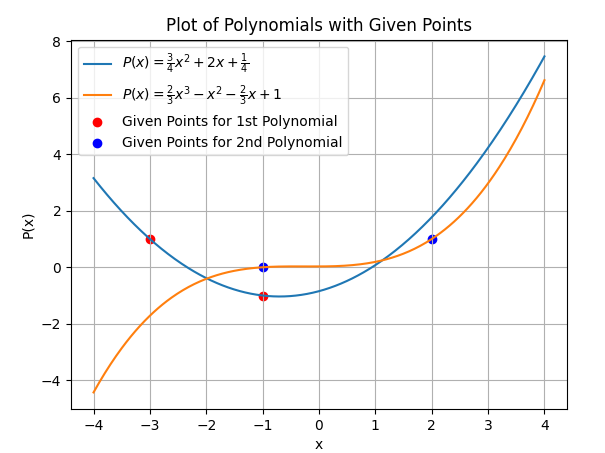
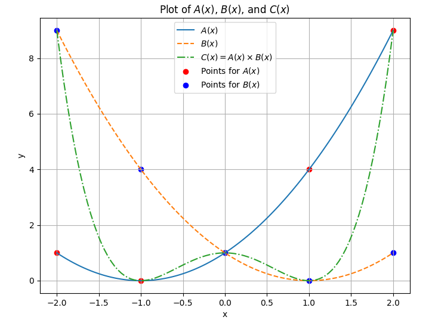

We can represent any line with exactly two coefficients. One for the degree zero term and one for the degree one term. The key part that makes this representation valid is that every representation has one-to-one mapping to a unique line. 

Consider the polynomial function $P(x) = p_0 + p_1x$ with the following points:

1. $(-2,0), (2,2)$
2. $(3,0), (-1,4)$
3. $P(x) = 3 - x$

Two points are sufficient to uniquely define a line. This principle extends to polynomials of degree 'd', which can be uniquely determined by 'd + 1' points.

{(-3,1), (-1,-1), (1,3)}
P(x) = \frac{3}{4} x^2 + 2x + \frac{1}{4}

{(-1,0), (0,1), (2,1)}
P(x) = \frac{2}{3} x^3 - x^2 - \frac{2}{3}x + 1

$$
\begin{align*}
\{(x_0, P(x_0)), (x_1, P(x_1)), \ldots , (x_d, P(x_d)) \} \\
\\
P(x) = p_0 + p_1x + p_2x^2 + \cdots + p_dx^d \\
P(x_0) = p_0 + p_1x_0 + p_2x_0^2 + \cdots + p_dx_0^d \\
P(x_1) = p_0 + p_1x_1 + p_2x_1^2 + \cdots + p_dx_1^d \\
P(x_d) = p_0 + p_1x_d + p_2x_d^2 + \cdots + p_dx_d^d \\
\end{align*}
$$

Let's recast these expressions as a matrix-vector product:

$$
\begin{bmatrix}
1 & x_0 & x_0^2 & \cdots & x_0^d \\
1 & x_1 & x_1^2 & \cdots & x_1^d \\
\vdots & \vdots & \vdots  & \ddots & \vdots  \\
1 & x_d & x_d^2 & \cdots & x_d^d 
\end{bmatrix}
$$

This matrix 'M' is invertible for unique 'x0, x1, ..., xd'. Hence, for any set of points, there exists a unique set of coefficients and consequently, a unique polynomial.

Two distinct representations for polynomials emerge:

1. Coefficient Representation [p0, p1, ..., pd]
2. Value Representation {(x0, P(x0)), (x1, P(x1)), ..., (xd, P(xd))}

The second representation simplifies polynomial multiplication significantly.

Given the polynomial function $A(x) = (x + 1)^2$ and the corresponding points:

$\text{points}_A = [(-2, 1), (-1, 0), (0, 1), (1, 4), (2, 9)]$

Given the polynomial function $B(x) = (x + 1)^2$ and the corresponding points:

$\text{points}_B = [(-2, 9), (-1, 4), (0, 1), (1, 0), (2, 1)]$

The resulting polynomial function from their multiplication is:
$C(x) = A(x) \times B(x)$

The resulting polynomial function from their multiplication is:
$C(x) = x^4 - 2x^2 + 1$

And the corresponding points for $C(x)$:
$\text{points}_C = [(-2, 9), (-1, 0), (0, 1), (1, 0), (2, 9)]$

This polynomial represents the function $C(x)$

This value representation helped us to reduced the time for multiplication from our original d^2  operations to the order of only degree d operations.