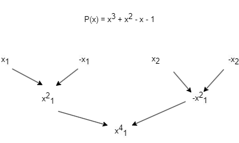

# Evaluation Points

When evaluating polynomials, the choice of evaluation points is crucial, particularly for the recursive algorithms used in the Fast Fourier Transform (FFT). 

## Which Evaluation Points?

Let's consider we have a degree 3 polynomial $P(x_0) = x^3 + x^2 - x - 1$ , which requires at least $n = 4$ points for its value representation. These points need to be positive-negative pairs, so we can write them as $x_1$, $-x_1$, $x_2$, and $-x_2$.

The recursive step in the FFT algorithm will require that we evaluate the odd and even parts of the polynomial at two points, $x_1^2$ and $x_2^2$. For the recursion to work effectively, these two points must also form positive-negative pairs, implying an equivalence between $x_2^2$ and $-x_1^2$.

At the bottom level of the recursion, we will have a single point, $x_1^4$. Interestingly, we are at liberty to choose these points. Let's explore the implications if we select our initial $x_1$ to be 1. This would mean that two of our initial points are $1$ and $-1$. Consequently, at the next level of recursion, $x_1^2$ and $-x_1^2$ will also be $1$ and $-1$, respectively. The bottom layer will then have only one point, which is $1$.

The question now is: What should $x_2$ be such that when we square $x_2$ we get $-1$? The answer is the complex number $i$. Hence, the four points at which we need to evaluate our polynomial are $1$, $-1$, $i$, and $-i$.

Another way to look at this is that we've essentially solved the equation $x^4 = 1$. At the bottom of the recursion, any of our original points raised to the fourth power was one. We know this equation has four solutions, all of which are part of a special set of points called the fourth roots of unity.

## Generalization

If we have a degree 5 polynomial, we'll need $n \geq 6$ points. Our recursive method halves the problem size, so choosing $n$ to be a power of two is convenient. Let's pick $n = 8$.

We now need to find eight points that form positive-negative pairs and that each, when raised to the eighth power, equals one. The correct points are the eighth roots of unity.

To generalize for any polynomial of degree $d$, we will pick $n \geq d + 1$ points, ensuring that $n$ is a power of two. The points we choose are the $nth$ roots of unity.