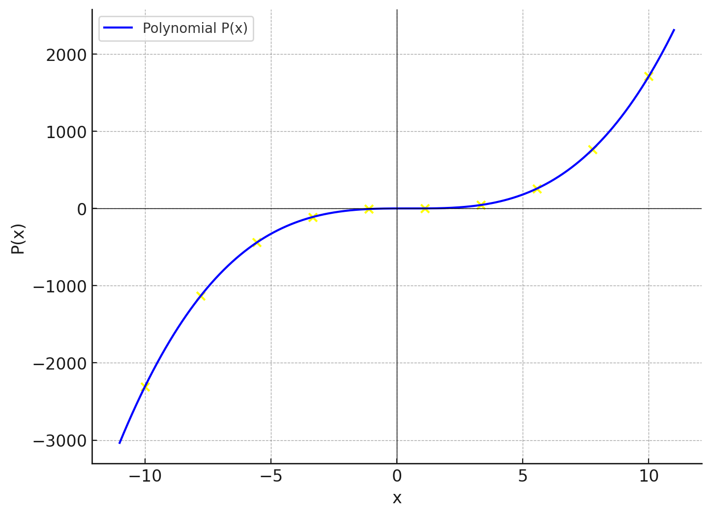

# Polynomial Evaluation

## Introduction
In polynomial evaluation, we are often faced with the task of computing the value of a polynomial at multiple points. This process can become inefficient, especially for polynomials of high degree and when evaluating at numerous points. In this README, we will explore various techniques to optimize polynomial evaluation, ultimately leading to the development of the Fast Fourier Transform (FFT) algorithm.

## Problem Statement
Given a polynomial $P(x)$ of degree $d$, we want to evaluate the polynomial at $n$ points, where $n$ is greater than $d + 1$.

## Naive Approach
The straightforward approach involves calculating the value of the polynomial at each point individually. However, this method is inefficient, requiring $O(nd)$ operations to evaluate all points.

## Optimization: Even and Odd Degree Terms
We can optimize polynomial evaluation by splitting the polynomial into even and odd degree terms. By factoring out $x$ from the odd degree terms, we obtain two new polynomials: one with only even degree terms and the other with only odd degree terms.

### Even Degree Polynomial
Let's denote the polynomial consisting of even degree terms as $P_{\text{even}}(x^2)$.

### Odd Degree Polynomial
Similarly, the polynomial consisting of odd degree terms is denoted as $xP_{\text{odd}}(x^2)$.

## Recursion
Now, we recursively evaluate $P_{\text{even}}(x^2)$ and $xP_{\text{odd}}(x^2)$ at half the number of points. This reduces the problem size and allows us to utilize the relationship between positive and negative paired points.

## Complex Numbers
To maintain positive-negative pairs during recursion, we expand the domain to include complex numbers. Special choices of complex numbers ensure that subsequent sets of points contain positive-negative pairs.

## Polynomial Evaluation Equations
Let's denote the evaluation of the polynomial $P(x)$ at $n$ points as follows:

$$
P(x_0) = p_0 + p_1x_0 + p_2x_0^2 + \cdots + p_dx_0^d
$$

$$
P(x_1) = p_0 + p_1x_1 + p_2x_1^2 + \cdots + p_dx_1^d
$$

$$
\vdots
$$

$$
P(x_{n-1}) = p_0 + p_1x_{n-1} + p_2x_{n-1}^2 + \cdots + p_dx_{n-1}^d
$$

Here is the plot for the polynomial $P(x)$ evaluated at $n$ points. The blue curve represents the polynomial, and the yellow dots show the values of the polynomial at the selected points.
## Conclusion
By employing these techniques, we can achieve an $O(n \log n)$ recursive algorithm for polynomial evaluation. This represents a significant improvement over the naive $O(nd)$ approach.

